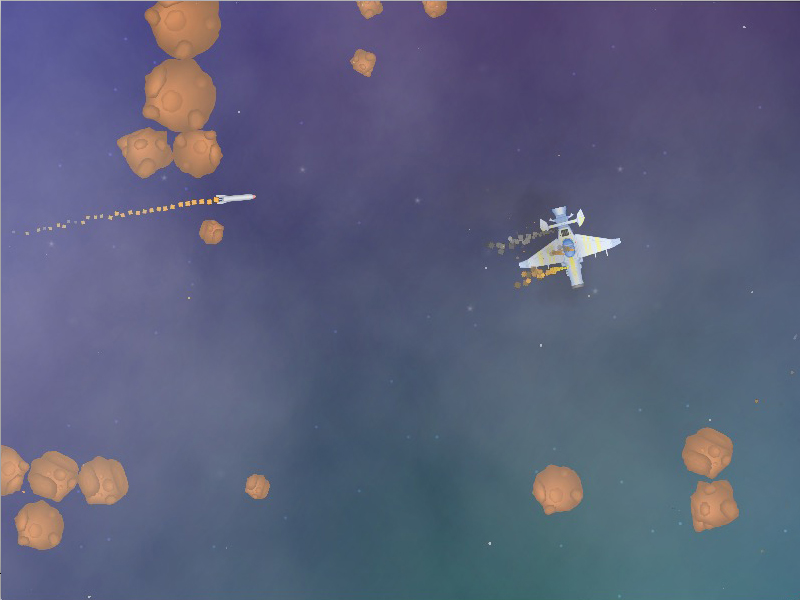

# Asteroids!-LÖVE

"Asteroids!" is a simple Shoot Them All game.

Goal: Destroy all asteroids.

Controls: 'W' - forward, 'A' - rotate right, 'D' - rotate left, 'SPACE' - fire.

Made with Love2d and some self-made libraries on top of Love Engine.

Music by [Eric Matyas](www.soundimage.org)

[Release available for Mac OS 64-bit & for Windows 32-bit](https://github.com/schwarzbox/Asteroids-Love2d/releases)

To run source code: clone repository, download & install [LÖVE 11.1](https://love2d.org) for you system and run asteroids.love.

