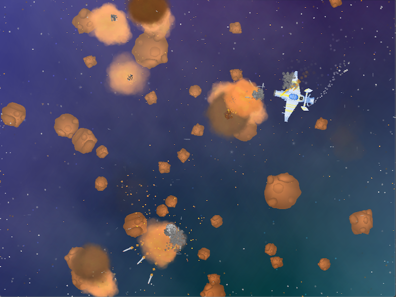

# Asteroids!

v3.0

"Asteroids" is a well known Shoot Them All game.

Destroy all asteroids.

No tutorials. No bonuses. No fullscreen.

HINT: 'W' - forward, 'A' - rotate right, 'D' - rotate left, 'SPACE' - fire.

Made with LÖVE and some self-made libraries on top of the engine.

[Release available for MacOS-arm64, MacOS-x86, Windows-64bit & Windows-32bit](https://github.com/schwarzbox/Asteroids/releases)

To run source code: clone repository, download & install [LÖVE 11.4](https://love2d.org) for your system.

Engine: [LÖVE Development Team](https://love2d.org/)

Design/Art/Code: [Aliaksandr Veledzimovich](https://twitter.com/veledzimovich)

Music: [Eric Matyas](https://soundimage.org)

